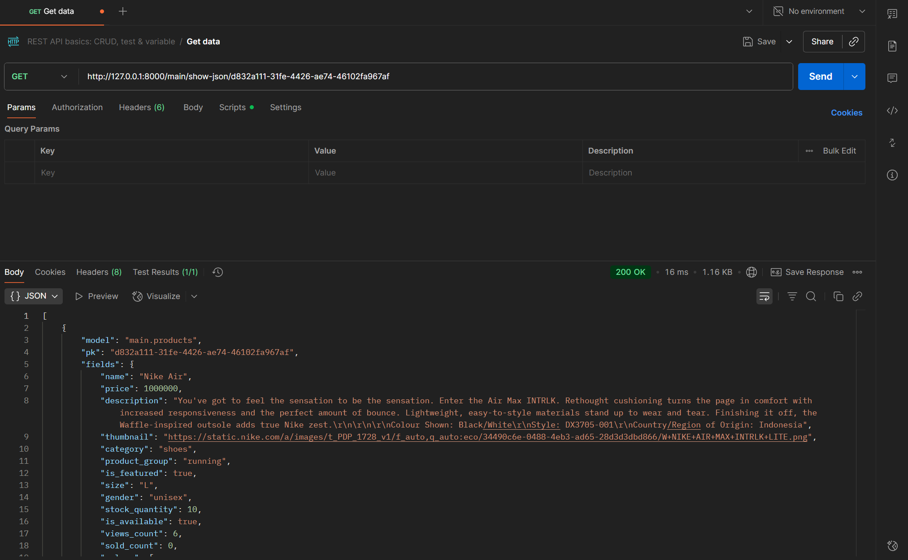
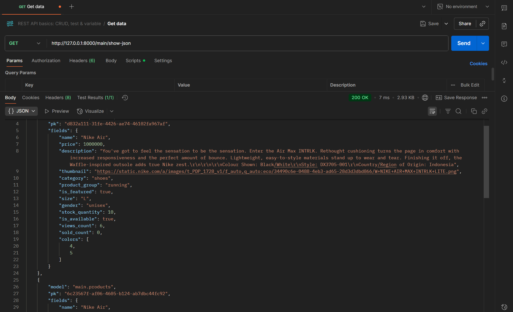
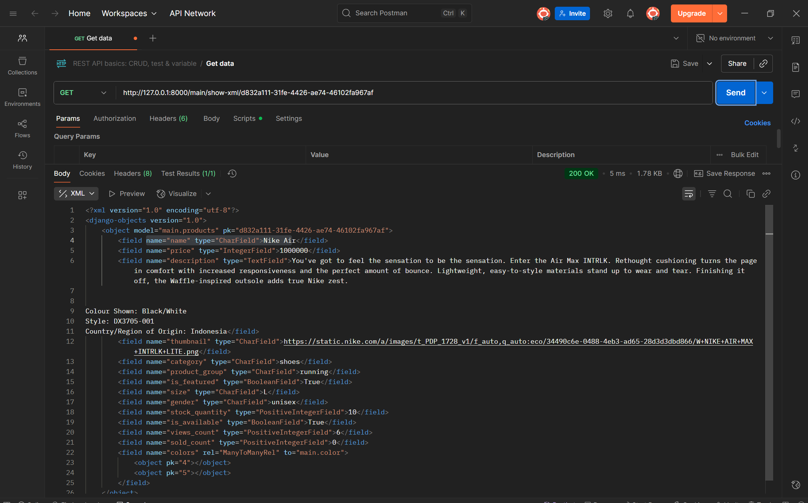
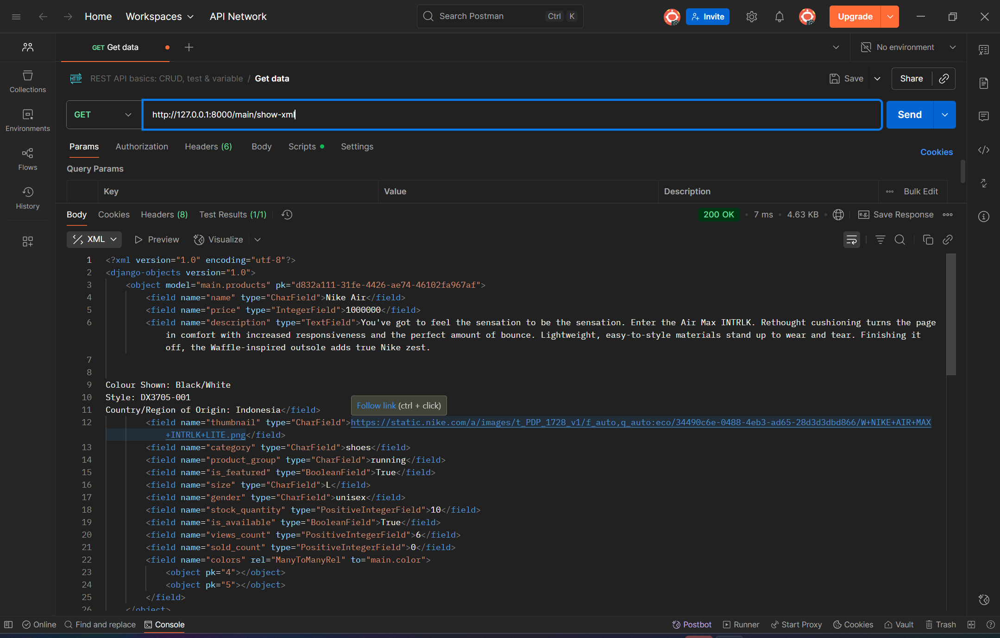

**Step-step dalam mengimplementasikan checklist tugas:**

1. Membuat direktori utama bernama athletica_sportsware yang akan menjadi root folder projek
2. Membuat file bernama requirements.txt yang berisikan library dan dependency yang akan digunakan dalam pengembangan web
3. Membuat virtual environment di dalam root folder tersebut agar seluruh library dan dependency terisolasi (terpisah dari sistem) dengan perintah **python -m venv env**
4. Mengaktifkan virtual environment di root folder dengan perintah **env/Scripts/activate**
5. Menginstall dependency dengan perintah pip install **-r requirements.txt**
6. Menjalankan perintah django-admin **startproject athletica_sportsware .** untuk membuat projek django di root folder
7. Membuat file **.env** yang berisikan environment variabel PRODUCTION dan di set False agar menggunakan database lokal
8. Membuat file **.env.prod** yang berisikan environment variabel kredensial database dan PRODUCTION di set True agar menggunakan database sesuai kredensial saat web di deploy
9. Konfigurasi file settings.py yang ada di project django
      1. Menambahkan **from dotenv import load_dotenv** untuk membaca file .env
      2. Menambahkan **import os** untuk mengakses nilai environment variable yang ada di file .env
      3. Mengonfigurasi database sesuai dengan nilai PRODUCTION
      4. Menambahkan **"localhost" dan "127.0.0.1"** ke ALLOWED_HOSTS
      5. Menambahkan **PRODUCTION = os.getenv('PRODUCTION', 'False').lower() == 'true'** di atas DEBUG untuk konfigurasi nilai PRODUCTION
      6. Mengonfigurasi database berdasarkan nilai database dengan kredensial yang diambil dari .env.prod
         
10. Menambahkan file .gitignore yang berisikan nilai-nilai yang diambil dari tutorial 0
11. Membuat aplikasi bernama main dengan perintah **django-admin startapp main**
12. Menambahkan 'main' pada INSTALLED_APPS yang ada di settings.py
13. Menambahkan folder template dan membuat main.html di dalamnya untuk template html yang menampilkan nama, npm, nama project, dan kelas
14. Membuat model yang berisika atribut-atribut yang ditetapkan
15. Menjalankan perintah **python manage.py makemigrations** lalu diikuti dengan **python manage.py migrate** untuk migrasi database sesuai dengan model yang sudah dibuat
18. Menambah **from django.shortcuts import render** di views.py untuk render template html yang digunakan
19. Membuat fungsi show_main yang mereturn render dari main.html yang contextnya berisikan data diri
20. Membuat file urls.py di aplikasi main, lalu menambahkan **from django.urls import path** dan menambahkan path '' untuk menampilkan fungsi show_main dengan nama path "show_main"
21. Menambahkan **from django.urls import path, include** pada urls.py yang ada di **project** lalu meng-include prefix lokasi '' agar diroute ke main.urls
22. Menjalankan perintah **git init** di root folder untuk menginisialisasi folder kosong .git (repo lokal)
23. Membuat repository baru di github bernama athletica-sportsware
24. Mengubungkan repository lokal (root folder) ke repository github dengan perintah **git remote add origin https://github.com/maknoon1a/athletica-sportsware**
25. Membuat branch baru pada repository github bernama master dengan perintah **git branch -M master**
26. Menjalankan perintah add, commit, dan push ke github dengan branch master
27. Membuat project di PWS bernama athleticasportsware, lalu menambahkan isi dari .env.prod ke environment variablesnya dengan SCHEMA = tugas_individu
28. Menambahkan URL project ke ALLOWED_HOSTS yang ada di settings.py
29. Menambahkan remote di root folder ke PWS dengan menjalankan perintah yang ada di "builds" dan memasukkan kredensial projet
30. Melakukan add, commit, dan push ke github

---------------------------------------------------------------------------------------------------------------------------------------------------------------------------------------------------

Bagan alur kerja request client ke web server dan kaitannya dengan urls.py, views.py, models.py, dan templates (berkas html)

referensi: https://learnbatta.com/blog/understanding-request-response-lifecycle-in-django-29/      

1. Awal mulanya, pengguna mengetik alamat website, contohnya host/products/ di browser, dan permintaan ini dikirim ke server web (Nginx).
2. Nginx menerima permintaan dan meneruskannya ke server aplikasi (Gunicorn) yang menjalankan kode Django.
3. Di Django, permintaan pertama kali diperiksa oleh berbagai komponen keamanan dan utility (Middleware) untuk memastikan segala sesuatunya valid dan aman.
4. Sistem kemudian mencari di daftar URL (urls.py) untuk menentukan fungsi View yang bertanggung jawab menangani halaman yang diminta.
5. Fungsi View yang ditunjuk kemudian bekerja. Fungsi View mengambil data dari database jika diperlukan dan menyiapkannya untuk ditampilkan.
      - Jika mengikuti alur merah, View mengambil data utama dari database menggunakan ORM. Contohnya, Product.objects.all() untuk menampilkan daftar produk.
      - Jika mengikuti alur biru, View hanya menyiapkan data inti secukupnya, sementara data tambahan (misalnya daftar kategori produk) nanti langsung diambil oleh template menggunakan template tags.
6. Django secara otomatis menambahkan data umum yang hampir selalu dibutuhkan (seperti info user yang login) ke dalam data yang akan ditampilkan.
7. Data yang sudah disiapkan dimasukkan ke dalam template HTML untuk menghasilkan halaman web yang utuh.
      - Pada alur merah, template sudah menerima data lengkap dari View (misalnya daftar produk, harga, stok), jadi template hanya perlu menampilkan.
      - Pada alur biru, template mungkin masih melakukan query tambahan lewat template tags untuk data dekoratif (misalnya sidebar kategori atau jumlah komentar).
8. Sebelum dikirim, halaman yang sudah jadi sekali lagi diperiksa dan mungkin ditambahi header keamanan tertentu.
9. Django mengirimkan hasil akhirnya kembali ke Gunicorn
10. Lalu dari Gunicorn diteruskan ke Nginx.
11. Nginx mengirimkan halaman web tersebut kembali ke browser pengguna, yang akhirnya ditampilkan tampilan html yang lengkap.

models.py adalah "cetak biru" yang menghubungkan kode Python dengan database, dimana kita mendefinisikan struktur tabel dan kolom-kolomnya. Ketika View memproses request, dia menggunakan ORM untuk mengambil data berdasarkan model ini (misalnya Product.objects.all()), baik secara langsung maupun melalui template tags yang juga merujuk ke models.py. Saat template dirender dan ditampilkan ke user, semua data yang muncul seperti {{ product.name }} sebenarnya tetap berasal dari struktur model yang sudah kita definisikan di models.py. Jadi, mau data diambil lewat View langsung atau melalui template tags, semuanya bergantung pada "aturan main" yang ditetapkan di models.py sebagai fondasi utama struktur data aplikasi kita.

disunting dengan bantuan chatgpt.com

---------------------------------------------------------------------------------------------------------------------------------------------------------------------------------------------------

settings.py adalah inti dari konfigurasi Django yang mengatur seluruh aspek aplikasi. File ini berisi pengaturan database (SQLite atau PostgreSQL), daftar aplikasi yang digunakan (INSTALLED_APPS), middleware untuk memproses request/response, lokasi template dan file statis, pengaturan keamanan seperti SECRET_KEY dan ALLOWED_HOSTS, serta konfigurasi bahasa dan zona waktu. Singkatnya, settings.py adalah "remote control" proyek Django dimana developer mengontrol semua perilaku aplikasi dari satu tempat.

---------------------------------------------------------------------------------------------------------------------------------------------------------------------------------------------------

Migrasi adalah sistem Django untuk menyinkronkan perubahan model dengan database secara otomatis. Prosesnya dimulai ketika developer membuat atau mengubah model di models.py, lalu menjalankan python manage.py makemigrations agar Django membaca perubahan dan membuat file instruksi migrasi (seperti CREATE TABLE atau ALTER TABLE) di folder migrations. Setelah itu, python manage.py migrate mengeksekusi instruksi tersebut ke database, dan Django mencatat setiap migrasi yang sudah dijalankan di tabel django_migrations. Dengan sistem ini, developer tidak perlu repot menulis SQL manual karena ORM dan migrasi otomatis memastikan struktur database selalu sinkron dengan model Python.

---------------------------------------------------------------------------------------------------------------------------------------------------------------------------------------------------

Django sering dijadikan titik awal belajar pengembangan perangkat lunak karena merupakan framework Python high-level yang memungkinkan developer membangun aplikasi web dengan cepat dan aman tanpa harus repot mengurus kerumitan teknis dari awal. Prinsip “Don’t Repeat Yourself” (DRY) yang digunakannya membuat komponen bisa dipakai ulang sehingga proses development jadi lebih efisien. Django juga dikenal sebagai “batteries included framework” karena sudah menyediakan banyak fitur bawaan seperti autentikasi pengguna, koneksi database, operasi CRUD, hingga Django Admin dan SQLite3 sebagai database default. Selain itu, framework ini punya dokumentasi yang sangat lengkap, mampu menangani aplikasi berskala besar, dipakai perusahaan besar seperti Instagram dan YouTube, serta mudah dipelajari bahkan oleh pemula tanpa pengalaman Django sebelumnya. Hal-hal inilah yang menjadikannya pilihan ideal sebagai permulaan belajar web development.

referensi: https://www.geeksforgeeks.org/python/python-web-development-django/      

---------------------------------------------------------------------------------------------------------------------------------------------------------------------------------------------------
---------------------------------------------------------------------------------------------------------------------------------------------------------------------------------------------------

TUGAS 3

Data delivery berperan penting dalam implementasi sebuah platform karena menjadi sarana utama untuk pertukaran informasi secara terstruktur dan efisien antara berbagai bagian sistem, misalnya antara frontend dengan backend atau antar layanan dalam arsitektur microservices. Dengan adanya mekanisme ini, data dapat dikirim, diterima, dan diproses secara konsisten, sehingga mempermudah integrasi, menjaga interoperabilitas, serta mendukung pengembangan sistem yang dapat diskalakan. Tanpa adanya data delivery yang baik, komunikasi antar komponen akan terganggu, yang dapat menimbulkan masalah seperti ketidakselarasan data, performa yang melambat, hingga hambatan saat menambahkan fitur baru.

Jika dibandingkan dengan XML, JSON lebih banyak digunakan pada pengembangan aplikasi web modern karena formatnya yang lebih ringkas, mudah dipahami, dan efisien dalam proses parsing maupun pengiriman data. JSON tidak mengandung tag berulang seperti XML sehingga ukuran data menjadi lebih kecil dan waktu transmisi lebih cepat. Selain itu, karena JSON terintegrasi secara native dengan JavaScript, penggunaannya sangat sesuai untuk aplikasi web maupun REST API. Sementara itu, XML dianggap lebih kompleks serta memerlukan sumber daya tambahan dalam pengolahan datanya.

Method is_valid() pada form Django berfungsi untuk melakukan validasi terhadap data yang diinput oleh pengguna sesuai dengan aturan yang telah ditentukan, misalnya validasi tipe data, panjang teks, atau batasan nilai. Adanya proses ini memastikan bahwa hanya data yang benar dan aman yang diteruskan untuk diproses, sehingga mengurangi risiko error input, pelanggaran konsistensi data, maupun celah keamanan. Selain itu, is_valid() juga membantu developer memberikan pesan kesalahan yang jelas kepada pengguna, sehingga pengalaman penggunaan aplikasi menjadi lebih baik.

Penggunaan csrf_token dalam form Django sangat penting untuk melindungi aplikasi dari serangan Cross-Site Request Forgery (CSRF). Token ini memastikan bahwa setiap request yang dikirim berasal dari sumber yang sah dan bukan hasil manipulasi pihak luar. Jika csrf_token tidak digunakan, penyerang bisa membuat form palsu untuk melakukan aksi berbahaya atas nama pengguna yang sedang login, misalnya mengubah data atau mengakses fitur sensitif. Dengan adanya token ini, setiap permintaan menjadi unik dan terverifikasi, sehingga resiko eksploitasi keamanan dapat diminimalisir.

Langkah-Langkah secara umum:
1. Membuat template base untuk di extends
2. Membuat 4 fungsi
      - show_json -> menampilkan seluruh product
      - show_json_byID -> ini untuk menampilkan data 1 product saja
      - show_xml 
      - show_xml_byID yang smaa fungsinya
3. Routing di url, dengan return HttpResponse dan content type nya sesuai dengan jenis data masing-masing
4. Membuat fungsi show_products yang menampilkan semua product dan terdapat tombol detail
5. Tombol detail tersebut di route ke products/id pada hrefnya dengan tag url dan parameter product.id
6. Membuat input dengan django form dengan membuat forms.py
7. Routing ke url untuk masuk ke halaman form dengan fungsi create_product di views

contoh salah satu produk dalam json

contoh semua produk dalam json

contoh salah satu produk dalam xml

contoh semua produk dalam xml

---------------------------------------------------------------------------------------------------------------------------------------------------------------------------------------------------
---------------------------------------------------------------------------------------------------------------------------------------------------------------------------------------------------

TUGAS 4

Langkah-langkah pengerjaan:

- Membuat fungsi registrasi pada views.py, mengimportnya di urls.py dan melakukan routing dengan template register.html. registrasi dibuat dengan mengunakan UserCreationForm yang di import dari django.contrib.auth.forms. Fungsi ini pertama akan mendapat request GET saat pertama kali page dibuka. Ketika user mengisi formnya dan menekan submit, request method berubah menjadi POST dan apabila valid akan di save ke database lalu akan redirect ke page login.
- Membuat fungsi login dan logout pada views.py, melakukan routing di urls.py dengan template login.html. Prosesnya sama seperti saat register. Responsenya ketika forms valid cookies akan dibuat dan store data last_login ke cookie. Redirect ke homepage dengan tampilan navbar yang sudah ditampilkan nama user dan tombol logout
- Membuat fungsi logout dan routing ke urls.py, lalu membuat tombol pada navbar disamping username saat sudah login dan langsung mengembalikan ke homepage yang tidak ada fitur cart dan my products
- Meretriksi fitur cart, my products supaya login terlebih dahulu dengan decorator @login_required yang diambil dari django.contrib.auth.decorators
- Apabila sudah login, fitur my products bisa diakses, lalu saya membuat tombol untuk menambahkan produk yang langsung masuk ke page penambahan produk
- Menghubungkan User dan Product dengan menambahkan field foreign key di model product. Lalu pada add_product sebelum disave set terlebih dahulu field tersebut dengan user yang sedang login sekarang melalui request (karena request menyimpan objek user yang sedang login) sehingga product yang dibuat pada saat suatu user sedang login belongs to user tersebut.

1. Django AuthenticationForm

Django AuthenticationForm adalah form bawaan django yang diambil dari django.contrib.auth.forms untuk menangani autentikasi user saat akan login. Apabila tidak di setting AUTH_USER_MODEL pada settings.py maka formnya akan otomatis membaca model User bawaan django pada django.contrib.auth.models. Secara default User memiliki 2 field yaitu username dan password sehingga nanti AuthenticationForm akan mencari dan mencocokan apakah input dari form tersebut ada di database model User. Hasil pencocokan tersebut dapat diakses melalui method .is_valid() --> mengembalikan True jika ada. Untuk mendapatkan objek usernya dapat menggunakan method .get_user() pada objek form yang dibuat. Kelebihannya adalah sudah built-in sehingga hanya tinggal menggunakan dan sudah divalidasi secara otomatis. Keamanannya juga sudah terjamin karena django sendiri yang handle. Beberapa kekurangannya:

      - AuthenticationForm hanya mendukung autentikasi standar berbasis username dan password, sehingga kalau aplikasi membutuhkan login dengan email, nomor telepon, atau field custom lain, form ini tidak bisa langsung dipakai tanpa modifikasi.

      - Validasi bawaan AuthenticationForm cukup sederhana, jadi kalau dibutuhkan aturan keamanan tambahan seperti captcha, two-factor authentication, atau rate limiting, developer harus menambahkan logika sendiri.

      - Karena form ini terikat pada sistem autentikasi bawaan Django, pengguna yang memakai custom user model dengan field unik kadang perlu membuat subclass atau form baru agar login berjalan sesuai kebutuhan.

2. Kelebihan dan kekurangan session dan cookies dalam menyimpan state di aplikasi web

Cookies lebih ringan karena data disimpan langsung di browser pengguna, cocok untuk menyimpan preferensi sederhana seperti bahasa atau tema, tetapi ukurannya terbatas dan rawan dimanipulasi atau dicuri. Session lebih aman karena data disimpan di server, sementara browser hanya menyimpan session ID, sehingga cocok untuk data sensitif seperti status login atau keranjang belanja. Namun, session menambah beban server dan memerlukan mekanisme pembersihan data lama, serta bisa menimbulkan masalah skala jika pengguna sangat banyak.

3. Keamanan Cookies Default

Cookies tidak sepenuhnya aman secara default karena rentan terhadap pencurian melalui serangan XSS, penyadapan jika tidak menggunakan HTTPS, dan risiko session hijacking. Django mengantisipasi hal ini dengan menyediakan pengaturan keamanan seperti HttpOnly agar cookie tidak bisa diakses JavaScript, Secure agar cookie hanya dikirim lewat HTTPS, serta menandatangani cookie untuk mencegah pemalsuan. Dengan cara ini, Django memastikan penggunaan cookies lebih aman, meskipun developer tetap harus mengaktifkan opsi keamanan sesuai kebutuhan aplikasinya.

---------------------------------------------------------------------------------------------------------------------------------------------------------------------------------------------------
---------------------------------------------------------------------------------------------------------------------------------------------------------------------------------------------------

Tugas 6 

Pada synchronous request, setiap permintaan harus menunggu respons dari server sebelum dapat melanjutkan proses berikutnya. Artinya, seluruh alur eksekusi akan berhenti sementara hingga server mengirimkan data yang diminta. Mekanisme ini sering kali membuat aplikasi terasa lambat jika proses di server memerlukan waktu lama.
Sebaliknya, asynchronous request memungkinkan proses lain tetap berjalan tanpa harus menunggu respons dari server. Permintaan dikirim di latar belakang, dan hasilnya akan diproses begitu respons diterima. Pendekatan ini umum digunakan dalam pengembangan aplikasi modern menggunakan AJAX karena meningkatkan performa serta memberikan pengalaman pengguna yang lebih responsif.
Contohnya, saat pengguna mengetik di kolom pencarian dan hasil muncul secara otomatis tanpa perlu memuat ulang halaman, proses tersebut dilakukan secara asynchronous.

AJAX (Asynchronous JavaScript and XML) bekerja dengan mengirimkan data ke server Django menggunakan HTTP request di latar belakang tanpa harus me-refresh halaman.
Alur umumnya adalah sebagai berikut:
      - Pengguna melakukan aksi di browser (misalnya klik tombol atau mengetik di form).
      - JavaScript mengirim request menggunakan XMLHttpRequest atau fetch() ke URL Django tertentu.
      - Django menerima request tersebut di view, memproses data (misalnya menyimpan ke database atau mengambil data tertentu), lalu mengembalikan  
      respons dalam format JSON.
      - JavaScript di sisi client menerima JSON tersebut dan memperbarui tampilan halaman secara dinamis.
      - Dengan alur ini, interaksi pengguna menjadi lebih cepat dan efisien karena hanya bagian tertentu dari halaman yang diperbarui, bukan keseluruhan halaman.

Penggunaan AJAX memberikan keuntungan utama berupa peningkatan efisiensi dan interaktivitas aplikasi. Pada render biasa, setiap kali pengguna berinteraksi, seluruh halaman perlu dimuat ulang oleh server dan dikirim ulang ke browser. Hal ini menyebabkan waktu respon lebih lama dan konsumsi bandwidth lebih besar.
Dengan AJAX, hanya data yang diperlukan yang dikirim dan diterima, sehingga proses menjadi lebih cepat dan ringan. Selain itu, pengguna dapat tetap berinteraksi dengan halaman selama data sedang diproses di latar belakang.
Keuntungan lain adalah pengalaman pengguna menjadi lebih halus — misalnya, pada fitur komentar atau pengiriman formulir yang tidak perlu refresh halaman, menjadikan aplikasi terasa lebih modern dan responsif.

Untuk memastikan keamanan AJAX pada fitur seperti Login dan Register, langkah pertama yang penting adalah menggunakan csrf_token. Token ini melindungi aplikasi dari serangan Cross-Site Request Forgery (CSRF) dengan memastikan bahwa setiap request berasal dari sumber yang sah (domain aplikasi itu sendiri).
Selain itu, Django menyediakan middleware bawaan yang secara otomatis memvalidasi token tersebut setiap kali request POST diterima.
Langkah lain yang perlu dilakukan adalah:
      - Gunakan HTTPS agar data terenkripsi saat dikirim.
      - Validasi input di sisi server menggunakan method is_valid() pada form Django agar data yang masuk sesuai aturan.
      - Hindari mengembalikan informasi sensitif dalam response AJAX, misalnya pesan error yang terlalu detail.
Dengan langkah-langkah ini, keamanan aplikasi dapat terjaga tanpa mengorbankan kenyamanan pengguna.

AJAX memiliki dampak besar terhadap User Experience (UX) karena memungkinkan halaman web berinteraksi secara cepat dan real-time tanpa harus memuat ulang seluruh halaman. Pengguna dapat melihat perubahan langsung pada tampilan, seperti notifikasi, update data, atau hasil pencarian instan, sehingga aplikasi terasa lebih interaktif dan responsif.
Selain itu, AJAX mengurangi waktu tunggu dan beban server karena hanya sebagian kecil data yang dikirim.
Sebagai contoh, pada fitur keranjang belanja di e-commerce, pengguna dapat menambah atau menghapus produk tanpa berpindah halaman — hal ini menciptakan alur belanja yang lebih halus dan efisien.
Dengan demikian, AJAX bukan hanya meningkatkan performa teknis, tetapi juga berperan penting dalam membangun pengalaman pengguna yang nyaman dan modern.